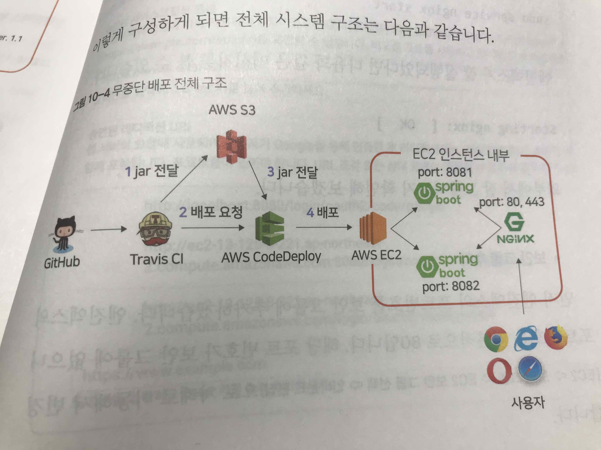

# SpringBoot AWS 책 - Chapter 10

## 24시간 중단없는 무중단 배포 방식

### 무중단 배포 방식

- AWS Blue-Green 무중단 배포 (비싼것이 단점이고 좋다)

- 도커를 이용한 웹서비스 무중단 배포

- L4 스위치 활용

- Nginx (웹서버,)

   

### 리버스프록시

* 캐싱, 로드밸런싱, 미디어스트리밍 등을 위한 오픈소스 소프트웨어) 이용 
* Nginx 80, 443 포트 (8081 혹은 8082를 연동was로 설정 체인지 & nginx reload )
* 스프링부트1 - 8081 포트
* 스프링부트2 - 8082 포트




### nginx 설치와 SpringBoot 연동하기

#### Nginx 설치

```bash
sudo yum install nginx
sudo service nginx start
```

#### 보안그룹 추가

> EC2 > 보안그룹 -> EC2 보안그룹선택 -> 인바운드 편집
>
> 80포트 인바운드 규칙 추가

* 8080 -> 80으로 전환되도록 변경된 리다이렉션 주소를 구글과 네이버에 등록
* 이제 8080포트를 제거하고, 80으로 접속 테스트

```bash
sudo vim /etc/nginx/nginx.conf
...
include /etc/nginx/conf.d/service-url.inc
location / {
	proxy_pass $service_url;
	proxy_set_header X-Real-IP $remote_addr;
	proxy_set_header X-Forwarded-For $proxy_add_x_forwarded_for;
	proxy_set_header Host $http_host;
}
...

#/etc/nginx/conf.d/service-url.inc
set $service_url http://127.0.0.1:8081;

sudo service nginx restart
```


### 무중단 배포 스크립트 만들기

Profile API 추가: ProfileController

```java
@RequiredArgsConstructor
@RestController
public class ProfileController {
  private final Environment env;
  
  @GetMapping("/profile")
  public String profile() {
    List<String> profiles = Arrays.asList(env.getActiveProfiles()); //실행중인 ActiveProfile 모두 가져옴 (real, oauth, real-db)
    
    ...
  }
}
```

Test Code 작성: **ProfileControllerUnitTest**

* 스프링환경이 필요없기 때문에 <u>@SpringBootTest없이 테스트 코드 작성</u>
* Environment는 인터페이스라 가짜구현체인 *MockEnvironment*를 사용
* 생성자 DI를 사용했기 때문에 가능

/profile 인증없이 동작하도록 SecurityConfig 클래스에 제외 코드 추가

SecurityConfig 설정 테스트를 위해 **ProfileControllerTest** 추가


#### real1, real2 profile 생성

```properties
server.port=8081 
# real2는 8082 Port
spring.profiles.include=oauth,real-db
spring.jpa.properties.hibernate.dialect=org.hibernate.dialect.MySQL5InnoDBDialect
spring.session.store-type=jdbc
```

#### Nginx Config 

무중단 배포의 핵심이다. 배포 때마다 Nginx Proxy 설정이 순식간에 교체됨. 

```bash
#/etc/nginx/conf.d/service-url.inc
set $service_url http://127.0.0.1:8081;

sudo service nginx restart
```


#### 배포 스크립트 작성 - step3 

appspec.yml - step3 로 수정


###### 무중단 배포 스크립트

* stop.sh : Nginx연결은 안되어 있지만, 실행중인 스프링 부트 종

* start.sh : 신규 배포할 SpringBoot 프로젝트를 stop.sh로 종료한 'profile'로 실행

* Health.sh : start.sh로 실행시킨 프로젝트 정상 여부 체크

* switch.sh : Nginx가 바라보는 스프링부트를 최신버전으로 변경

* profile.sh : 앞의 4개 스크립트에서 공용으로 사용할 'profile'과 포트 체크 로직

  

###### App spec.yml AfterInstall에 스크립트 등록 

* Jar 복사 이후 stop.sh -> start.sh 실행

* ValidateService에 health.sh 

  ```yaml
  hooks:
  	AfterInstall:
  	  - location: stop.sh
  	    timeout: 60
  	    runas: ec2-user
  	ApplicationStart:
  	  - location: start.sh
  	    ...
  	ValidateService:
  	  - location: health.sh #새 스프링부터 정상 실행 여부 체크
  	    ...
  ```

switch.sh 교체 핵심

```bash
echo 'set \$service_url http://127.0.0.1:${IDLE_PORT};' | sudo tee /etc/nginx/conf.d/service-url.inc
# tee는 standard input을 standard output으로 변환 (echo -> file 덮어씀)
# 홑따옴표('')를 사용해야 \$service_url을 변수가 아닌 문자로 인식함. 

sudo service nginx reload #restart와 달리 끊김없이 다시불러옴 (graceful restart)
#중요설정 변경시 restart 해야함. 여기선 외부설정파일인 service-url을 다시 불러오는 것이라 가능
```


### 무중단 배포 테스트

```groovy
// build.gradle 수정 
version '1.0.4-SNAPSHOT-'+new Date().format("yyyyMMddHHmmss") //groovy 문법 new Date()로 빌드할때마다 시간 추가 
```

최종코드 깃허브 푸시 

배포 자동진행이 되면 CodeDeploy 로그로 진행 여부 모니터링

```bash
tail -f /opt/codedeploy-agent/deployment-root/deployment-logs/codedeploy-agent-deployments.log

# springboot log
vim ~/app/step3/nohup.out

# java application은 2개 실행됨 (1개만 nginx연결되어 상용 서비스)
ps -ef | grep java

# 1초마다 서비스 호출 테스트 (was 변경 배포 모니터링)
while sleep 1; do curl localhost; done
```

이제 이 시스템은 마스터 브랜치에 푸시가 발생하면 자동으로 서버 배포가 진행되고, 서버 중단이 전혀 없는 시스템이 되었다. 


-끝-


